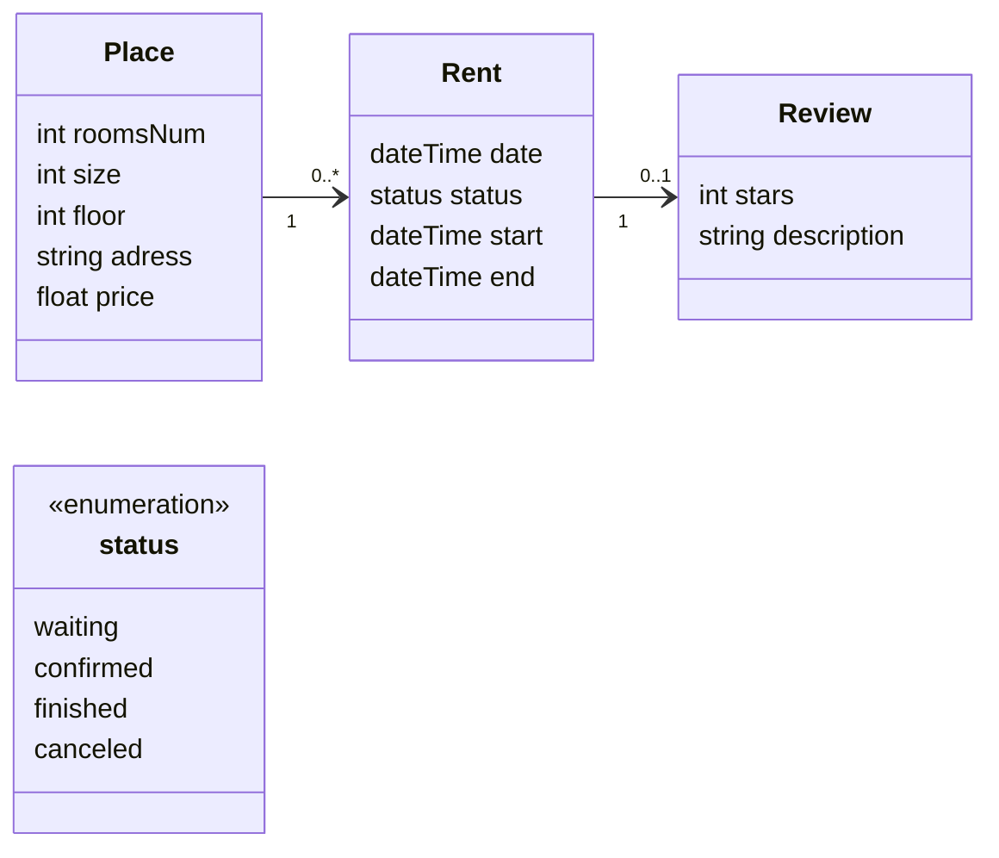

# T120B165-Web-Application-Design

## Nekilnomojo turto valdymo sistema

### Uždavinio aprašymas

Nekilnojamojo turto valdymo sistema skirta padėti butų savininkams efektyviai valdyti savo turtą bei leisti nuomininkams patogiai rezervuoti ir nuomotis nekilnojamąjį turtą. Ši sistema leidžia savininkams talpinti butų nuomos pasiūlymus, sekti rezervacijas, o nuomininkams lengvai rasti butus, rezervuoti juos ir pateikti atsiliepimus apie nuomojamus objektus.

Sistemos paskirtis:

- Pateikti visą reikiamą informaciją apie laisvus nuomojamus butus.
- Leisti nuomininkams rasti butus pagal poreikius, pateikti rezervacijas, rašyti atsiliepimus.
- Suteikti administratoriui įrankius valdyti platformos turinį, vartotojus.

### Funkciniai reikalavimai

1. **Nuomininko funkcijos:**
   - Peržiūrėti butus pagal pasirinktus kriterijus (plotas, aukštas, miegamųjų skaičius, kaina ir pan.).
   - Rezervuoti butą pasirinktam laikotarpiui.
   - Stebėti nuomos būseną (laukia patvirtinimo, patvirtinta, baigta, atšaukta).
   - Palikti atsiliepimą apie nuomotą butą (įvertinimas, komentaras).
   - Peržiūrėti nuomų istoriją.
2. **Savininko funkcijos:**
   - Patalpinti informaciją apie nuomojamą butą (adresas, plotas, miegamųjų skaičius, kaina, ir t.t.).
   - Peržiūrėti visų rezervacijų sąrašą ir jų būseną.
   - Patvirtinti arba atmesti buto rezervacijas.
   - Peržiūrėti nuomininkų atsiliepimus apie butus.
   - Redaguoti arba atnaujinti buto informaciją.
3. **Administratoriaus funkcijos:**
   - Valdyti vartotojų paskyras (nuomininkų ir savininkų).
   - Redaguoti ir moderuoti butų informaciją bei atsiliepimus.
   - Turėti prieigą prie visų sistemos duomenų ir įrankių, reikalingų tvarkyti platformą.

### Pasirinktų technologijų aprašymas:

1. Backend technologijos:
   - Programavimo kalba: C#
   - Duomenų bazė: PostgreSQL
   - Autentifikacija: JWT
2. Frontend technologijos:
   - React.js
   - TailwindCSS

### Objektai:

1. **Butas**

- Kambarių skaičius: bute esančių kambarių skaičius.
- Kvdaratiniai metrai: buto plotas kvadratiniais metrais.
- Aukštas: buto aukštas pastate
- Adresas: buto adresas (gatvė, miestas, šalis).
- Nuomos kaina: mėnesinė nuomos kaina (eurais).

2. **Rezervacija / Nuoma**

- Data: rezervacijos ar nuomos sukūrimo data.
- Statusas: rezervacijos statusas (laukia patvirtinimo, patvirtinta, baigta, atšauktą).
- Pradžia: nuomos laikotarpio pradžia.
- Pabaiga: nuomos laikotarpio pabaiga.

3. **Atsiliepimas**

- Ivertinimas: nuomos įvertinimas (1-5 žvaigždutės).
- Komentaras: vieta nuomininkui pateikti savo įspūdžius apie butą ir/ar nuomos patirtį.

### Hierarchiniai ryšiai:

- **Butas -> Rezervacija**: Vienas butas gali turėti kelias rezervacijas skirtingiems laikotarpiams.
- **Rezervacija -> Atsiliepimas**: Kiekviena užbaigta rezervacija gali turėti vieną atsiliepimą nuo nuomininko.

### Rolės:

- **Nuomininkas**: gali ieškoti butų, rezervuoti juos, palikti atsiliepimus.
- **Savininkas**: gali skelbti butus, tvarkyti rezervacijas, peržiūrėti atsiliepimus.
- **Administratorius**: turi visas valdymo funkcijas, įskaitant vartotojų administravimą, butų rezervacijų ir atsiliepimų priežiūrą.
