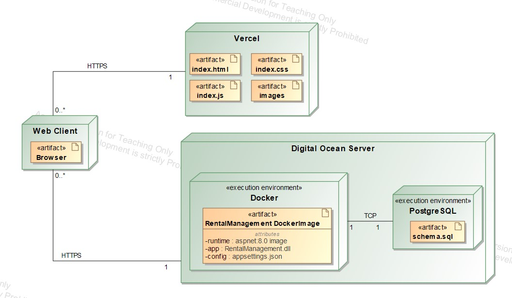

# Nekilnomojo turto valdymo sistema

## Uždavinio aprašymas

Nekilnojamojo turto valdymo sistema skirta padėti butų savininkams efektyviai valdyti savo turtą bei leisti nuomininkams patogiai rezervuoti ir nuomotis nekilnojamąjį turtą. Ši sistema leidžia savininkams talpinti butų nuomos pasiūlymus, sekti rezervacijas, o nuomininkams lengvai rasti butus, rezervuoti juos ir pateikti atsiliepimus apie nuomojamus objektus.

Sistemos paskirtis:

- Pateikti visą reikiamą informaciją apie laisvus nuomojamus butus.
- Leisti nuomininkams rasti butus pagal poreikius, pateikti rezervacijas, rašyti atsiliepimus.
- Suteikti administratoriui įrankius valdyti platformos turinį, vartotojus.

## Funkciniai reikalavimai

1. **Nuomininko funkcijos:**
   - Peržiūrėti butus pagal pasirinktus kriterijus (plotas, aukštas, miegamųjų skaičius, kaina ir pan.).
   - Rezervuoti butą pasirinktam laikotarpiui.
   - Stebėti nuomos būseną (laukia patvirtinimo, patvirtinta, baigta, atšaukta).
   - Palikti atsiliepimą apie nuomotą butą (įvertinimas, komentaras).
   - Peržiūrėti nuomų istoriją.
2. **Savininko funkcijos:**
   - Patalpinti informaciją apie nuomojamą butą (adresas, plotas, miegamųjų skaičius, kaina, ir t.t.).
   - Peržiūrėti visų rezervacijų sąrašą ir jų būseną.
   - Patvirtinti arba atmesti buto rezervacijas.
   - Peržiūrėti nuomininkų atsiliepimus apie butus.
   - Redaguoti arba atnaujinti buto informaciją.
3. **Administratoriaus funkcijos:**
   - Valdyti vartotojų paskyras (nuomininkų ir savininkų).
   - Redaguoti ir moderuoti butų informaciją bei atsiliepimus.
   - Turėti prieigą prie visų sistemos duomenų ir įrankių, reikalingų tvarkyti platformą.

## Pasirinktų technologijų aprašymas:

1. Backend technologijos:
   - Programavimo kalba: C#
   - Duomenų bazė: PostgreSQL
   - Autentifikacija: JWT
2. Frontend technologijos:
   - React.js
   - TailwindCSS

## Objektai:

1. **Butas**

- Kambarių skaičius: bute esančių kambarių skaičius.
- Kvdaratiniai metrai: buto plotas kvadratiniais metrais.
- Aukštas: buto aukštas pastate
- Adresas: buto adresas (gatvė, miestas, šalis).
- Nuomos kaina: mėnesinė nuomos kaina (eurais).

2. **Rezervacija / Nuoma**

- Data: rezervacijos ar nuomos sukūrimo data.
- Statusas: rezervacijos statusas (laukia patvirtinimo, patvirtinta, baigta, atšauktą).
- Pradžia: nuomos laikotarpio pradžia.
- Pabaiga: nuomos laikotarpio pabaiga.

3. **Atsiliepimas**

- Ivertinimas: nuomos įvertinimas (1-5 žvaigždutės).
- Komentaras: vieta nuomininkui pateikti savo įspūdžius apie butą ir/ar nuomos patirtį.

## Hierarchiniai ryšiai:

- **Butas -> Rezervacija**: Vienas butas gali turėti kelias rezervacijas skirtingiems laikotarpiams.
- **Rezervacija -> Atsiliepimas**: Kiekviena užbaigta rezervacija gali turėti vieną atsiliepimą nuo nuomininko.


## Rolės:

- **Nuomininkas**: gali ieškoti butų, rezervuoti juos, palikti atsiliepimus.
- **Savininkas**: gali skelbti butus, tvarkyti rezervacijas, peržiūrėti atsiliepimus.
- **Administratorius**: turi visas valdymo funkcijas, įskaitant vartotojų administravimą, butų rezervacijų ir atsiliepimų priežiūrą.

## Paleidimo instrukcija

Norėdami paleisti šį projektą, atlikite šiuos žingsnius:

### Backend

1. **Įdiekite reikalingas priklausomybes**: Atidarykite teminalą ir eikite į `RentalManagement` katalogą. Paleiskite komandą:
   ```sh
   dotnet restore
   ```
2. **Konfigūruokite duomenų bazę**: Įsitikinkite, kad `appsettings.json` ir `appsettings.Development.json` failuose yra teisingi duomenų bazės prisijungimo duomenys.
3. **Paleiskite duomenų bazės migracijas**: Paleiskite komandą:
   ```sh
   dotnet ef database update
   ```
4. **Paleiskite backend serverį**: Paleiskite šią komandą:
   ```sh
   dotnet run
   ```

### Frontend

1. **Įdiekite reikalingas priklausomybes**: Atidarykite teminalą ir eikite į `rental-management-frontend` katalogą. Paleiskite šią komandą:
   ```sh
   npm install
   ```
2. **Paleiskite frontend serverį**: Paleiskite šią komandą:
   ```sh
   npm start
   ```

### Docker

Jei norite paleisti projektą naudojant Docker, naudokite šią komandą:

```sh
docker-compose up
```

### Naudotojo sąsajos wireframe

Toliau pateikiami kai kurie naudotojo sąsajos wireframe pavyzdžiai.

<table>
   <tr>
      <td></td>
      <td></td>
   </tr>
   <tr>
      <td></td>
      <td></td>
   </tr>
   <tr>
      <td></td>
      <td></td>
   </tr>
</table>

### Naudotojo sąsajos dizainas

Toliau pateikiami kai kurie naudotojo sąsajos dizaino pavyzdžiai.

<table>
   <tr>
      <td></td>
      <td></td>
   </tr>
   <tr>
      <td></td>
      <td></td>
   </tr>
   <tr>
      <td></td>
      <td></td>
   </tr>
   <tr>
      <td></td>
   </tr>
</table>

Modalai

<table>
   <tr>
      <td></td>
      <td></td>
   </tr>
   <tr>
      <td></td>
   </tr>
</table>

### UML "Deployment" diagrama

Naudojant "Docker" konteinerius, sistema susideda iš trijų komponentų: "Frontend", "Backend" ir "Database". Frontend patalpinome "Vercel" platformoje, o Backend ir Database patalpinome "DigitalOcean", Backend patalpinome "Docker" konteineryje, o Database patalpinome "PostgreSQL" konteineryje.



### OpenAPI specifikacija

Buvo realizuotos vietų, rezervacijų ir atsiliepimų CRUD operacijos. Taip pat buvo realizuota vartotojo autentifikacija ir autorizacija. Norint pamayti visą OpenAPI specifikaciją, spauskite [čia](docs/swagger.json).

#### Autentifikacija

- **Registracija** `(POST /api/Authentication/Register)`: Leidžia vartotojams registruotis sistemoje pateikiant vartotojo duomenis.

  - Užklausa

  ```json
  {
    "userName": "JohnDoe",
    "email": "JohnDoe@email.com",
    "roles": ["Tennant"],
    "password": "password123"
  }
  ```

  - Atsakymo pavyzdys:

  ```http
  HTTP/1.1 200 OK
  ```

- **Prisijungimas** `(POST /api/Authentication/Login)`: Leidžia vartotojams prisijungti prie sistemos pateikiant vartotojo vardą ir slaptažodį.

  - Užklausa

  ```json
  {
    "userName": "JohnDoe",
    "password": "password123"
  }
  ```

  - Atsakymo pavyzdys:

  ```http
  HTTP/1.1 200 OK
  {
    "accessToken": "eyJhb"
  }
  ```

- **Atnaujinti prisijungimo žetoną** `(POST /api/Authentication/RefreshToken)`: Leidžia atnaujinti prisijungimo žetoną.

  - Atsakymo pavyzdys:

  ```http
  HTTP/1.1 200 OK
  {
      "accessToken": "eyJhb"
  }
  ```

- **Atsijungimas** `(POST /api/Authentication/Logout)`: Leidžia vartotojams atsijungti nuo sistemos.

  - Atsakymo pavyzdys:

  ```http
  HTTP/1.1 200 OK
  ```

#### Vietos

- **Gauti visas vietas** `(GET /api/Places)`: Grąžina visų vietų sąrašą.

  - Atsakymo pavyzdys:

  ```http
  HTTP/1.1 200 OK
  [
    {
      "id": 1,
      "roomsCount": 3,
      "size": 100,
      "address": "1234 Main St, Springfield, IL 62701",
      "description": "Beautiful place with a view of the park",
      "price": 1000
    }
  ]
  ```

- Sukurti naują vietą `(POST /api/Places)`: Leidžia sukurti naują vietą pateikiant vietos duomenis.

  - Užklausa

  ```json
  {
    "roomsCount": 3,
    "size": 100,
    "address": "1234 Main St, Springfield, IL 62701",
    "description": "Beautiful place with a view of the park",
    "price": 1000
  }
  ```

  - Atsakymų pavyzdžiai:

  ```http
  HTTP/1.1 201 Created
  {
     "roomsCount": 3,
     "size": 100,
     "address": "1234 Main St, Springfield, IL 62701",
     "description": "Beautiful place with a view of the park",
     "price": 1000
  }
  ```

  ```http
  HTTP/1.1 400 Bad Request
  {
     "type": "https://tools.ietf.org/html/rfc7231#section-6.5.1",
     "title": "One or more validation errors occurred.",
     "status": 400,
     "errors": {
        "roomsCount": [
           "The RoomsCount field is required."
        ],
        "size": [
           "The Size field is required."
        ],
        "address": [
           "The Address field is required."
        ],
        "price": [
           "The Price field is required."
        ]
     }
  }
  ```

  ```http
  HTTP/1.1 401 Unauthorized
  {
        "type": "https://tools.ietf.org/html/rfc7235#section-3.1",
        "title": "Unauthorized",
        "status": 401,
        "detail": "You are not authorized to access this resource."
  }
  ```

- **Gauti vietą pagal ID** `(GET /api/Places/{placeId})`: Grąžina vietos informaciją pagal pateiktą ID.

  - Atsakymų pavyzdžiai:

  ```http
  HTTP/1.1 200 OK
  {
    "roomsCount": 3,
    "size": 100,
    "address": "1234 Main St, Springfield, IL 62701",
    "description": "Beautiful place with a view of the park",
    "price": 1000
  }
  ```

  ```http
  HTTP/1.1 404 Not Found
  {
   "type": "https://tools.ietf.org/html/rfc7231#section-6.5.4",
   "title": "Not Found",
   "status": 404,
   "detail": "The resource you requested does not exist."
  }
  ```

- **Atnaujinti vietą pagal ID** `(PUT /api/Places/{placeId})`: Leidžia atnaujinti vietos informaciją pagal pateiktą ID.

  - Užklausa

  ```json
  {
    "roomsCount": 3,
    "size": 100,
    "address": "1234 Main St, Springfield, IL 62701",
    "description": "Beautiful place with a view of the park",
    "price": 1000
  }
  ```

  - Atsakymų pavyzdžiai:

  ```http
  HTTP/1.1 200 OK
   {
      "roomsCount": 3,
      "size": 100,
      "address": "1234 Main St, Springfield, IL 62701",
      "description": "Beautiful place with a view of the park",
      "price": 1000
   }
  ```

  ```http
  HTTP/1.1 400 Bad Request
  {
      "type": "https://tools.ietf.org/html/rfc7231#section-6.5.1",
      "title": "One or more validation errors occurred.",
      "status": 400,
      "errors": {
         "roomsCount": [
         "The RoomsCount field is required."
         ],
         "size": [
         "The Size field is required."
         ],
         "address": [
         "The Address field is required."
         ],
         "price": [
         "The Price field is required."
         ]
      }
  }
  ```

  ```http
  HTTP/1.1 403 Forbidden
  {
        "type": "https://tools.ietf.org/html/rfc7231#section-6.5.3",
        "title": "Forbidden",
        "status": 403,
        "detail": "You are not allowed to access this resource."
  }
  ```

  ```http
  HTTP/1.1 404 Not Found
   {
         "type": "https://tools.ietf.org/html/rfc7231#section-6.5.4",
         "title": "Not Found",
         "status": 404,
         "detail": "The resource you requested does not exist."
   }
  ```

- **Ištrinti vietą pagal ID** `(DELETE /api/Places/{placeId})`: Leidžia ištrinti vietą pagal pateiktą ID.

  - Atsakymų pavyzdžiai:

  ```http
  HTTP/1.1 204 No Content
  ```

  ```http
  HTTP/1.1 403 Forbidden
  {
        "type": "https://tools.ietf.org/html/rfc7231#section-6.5.3",
        "title": "Forbidden",
        "status": 403,
        "detail": "You are not allowed to access this resource."
  }
  ```

  ```http
  HTTP/1.1 404 Not Found
   {
         "type": "https://tools.ietf.org/html/rfc7231#section-6.5.4",
         "title": "Not Found",
         "status": 404,
         "detail": "The resource you requested does not exist."
   }
  ```

#### Rezervacijos

- **Gauti visas rezervacijas vietai** `(GET /api/Places/{placeId}/Reservations)`: Grąžina visų rezervacijų sąrašą konkrečiai vietai.

  - Atsakymų pavyzdžiai:

  ```http
  HTTP/1.1 200 OK
  [
    {
      "id": 1,
      "startDate": "2021-09-01T00:00:00Z",
      "endDate": "2021-09-10T00:00:00Z",
      "price": 100
    }
  ]
  ```

  ```http
  HTTP/1.1 404 Not Found
   {
         "type": "https://tools.ietf.org/html/rfc7231#section-6.5.4",
         "title": "Not Found",
         "status": 404,
         "detail": "The resource you requested does not exist."
   }
  ```

- **Sukurti naują rezervaciją** `(POST /api/Places/{placeId}/Reservations)`: Leidžia sukurti naują rezervaciją konkrečiai vietai.

  - Užklausa

  ```json
  {
    "startDate": "2021-09-01T00:00:00Z",
    "endDate": "2021-09-10T00:00:00Z",
    "price": 100
  }
  ```

  - Atsakymų pavyzdžiai:

  ```http
  HTTP/1.1 201 Created
  {
    "startDate": "2021-09-01T00:00:00Z",
    "endDate": "2021-09-10T00:00:00Z",
    "price": 100
  }
  ```

  ```http
  HTTP/1.1 400 Bad Request
  {
      "type": "https://tools.ietf.org/html/rfc7231#section-6.5.1",
      "title": "One or more validation errors occurred.",
      "status": 400,
      "errors": {
         "startDate": [
         "The StartDate field is required."
         ],
         "endDate": [
         "The EndDate field is required."
         ],
         "price": [
         "The Price field is required."
         ]
      }
  }
  ```

  ```http
  HTTP/1.1 401 Unauthorized
  {
        "type": "https://tools.ietf.org/html/rfc7235#section-3.1",
        "title": "Unauthorized",
        "status": 401,
        "detail": "You are not authorized to access this resource."
  }
  ```

  ```http
  HTTP/1.1 404 Not Found
   {
          "type": "https://tools.ietf.org/html/rfc7231#section-6.5.4",
          "title": "Not Found",
          "status": 404,
          "detail": "The resource you requested does not exist."
    }
  ```

  ```http
  HTTP/1.1 409 Conflict
  {
        "type": "https://tools.ietf.org/html/rfc7231#section-6.5.8",
        "title": "Conflict",
        "status": 409,
        "detail": "The reservation dates overlap with an existing reservation."
  }
  ```

- **Gauti rezervaciją pagal ID** `(GET /api/Places/{placeId}/Reservations/{reservationId})`: Grąžina rezervacijos informaciją pagal pateiktą ID.

  - Atsakymų pavyzdžiai:

  ```http
  HTTP/1.1 200 OK
  {
    "id": 1,
    "startDate": "2021-09-01T00:00:00Z",
    "endDate": "2021-09-10T00:00:00Z",
    "price": 100
  }
  ```

  ```http
  HTTP/1.1 404 Not Found
   {
         "type": "https://tools.ietf.org/html/rfc7231#section-6.5.4",
         "title": "Not Found",
         "status": 404,
         "detail": "The resource you requested does not exist."
   }
  ```

- **Atnaujinti rezervaciją pagal ID** `(PUT /api/Places/{placeId}/Reservations/{reservationId})`: Leidžia atnaujinti rezervacijos informaciją pagal pateiktą ID.

  - Užklausa

  ```json
  {
    "startDate": "2021-09-01T00:00:00Z",
    "endDate": "2021-09-10T00:00:00Z",
    "price": 100
  }
  ```

  - Atsakymų pavyzdžiai:

  ```http
  HTTP/1.1 200 OK
  {
      "startDate": "2021-09-01T00:00:00Z",
      "endDate": "2021-09-10T00:00:00Z",
      "price": 100
  }
  ```

  ```http
  HTTP/1.1 400 Bad Request
  {
      "type": "https://tools.ietf.org/html/rfc7231#section-6.5.1",
      "title": "One or more validation errors occurred.",
      "status": 400,
      "errors": {
         "startDate": [
         "The StartDate field is required."
         ],
         "endDate": [
         "The EndDate field is required."
         ],
         "price": [
         "The Price field is required."
         ]
      }
  }
  ```

  ```http
  HTTP/1.1 401 Unauthorized
  {
        "type": "https://tools.ietf.org/html/rfc7235#section-3.1",
        "title": "Unauthorized",
        "status": 401,
        "detail": "You are not authorized to access this resource."
  }
  ```

  ```http
  HTTP/1.1 404 Not Found
   {
         "type": "https://tools.ietf.org/html/rfc7231#section-6.5.4",
         "title": "Not Found",
         "status": 404,
         "detail": "The resource you requested does not exist."
   }
  ```

  ```http
  HTTP/1.1 422 Unprocessable Entity
  {
        "type": "https://tools.ietf.org/html/rfc7231#section-6.5.14",
        "title": "Unprocessable Entity",
        "status": 422,
        "detail": "The updated Reservation is invalid"
  }
  ```

- **Ištrinti rezervaciją pagal ID** `(DELETE /api/Places/{placeId}/Reservations/{reservationId})`: Leidžia ištrinti rezervaciją pagal pateiktą ID.

  - Atsakymų pavyzdžiai:

  ```http
  HTTP/1.1 204 No Content
  ```

  ```http
  HTTP/1.1 400 Bad Request
  {
      "type": "https://tools.ietf.org/html/rfc7231#section-6.5.1",
      "title": "One or more validation errors occurred.",
      "status": 400,
      "errors": {
         "reservationId": [
         "The ReservationId field is required."
         ]
      }
  }
  ```

  ```http
  HTTP/1.1 401 Unauthorized
  {
        "type": "https://tools.ietf.org/html/rfc7235#section-3.1",
        "title": "Unauthorized",
        "status": 401,
        "detail": "You are not authorized to access this resource."
  }
  ```

  ```http
  HTTP/1.1 403 Forbidden
   {
         "type": "https://tools.ietf.org/html/rfc7231#section-6.5.3",
         "title": "Forbidden",
         "status": 403,
         "detail": "You are not allowed to access this resource."
   }
  ```

  ```http
  HTTP/1.1 404 Not Found
   {
         "type": "https://tools.ietf.org/html/rfc7231#section-6.5.4",
         "title": "Not Found",
         "status": 404,
         "detail": "The resource you requested does not exist."
   }
  ```

#### Atsiliepimai

- **Gauti visus atsiliepimus vietai** `(GET /api/Places/{placeId}/Reviews)`: Grąžina visų atsiliepimų sąrašą konkrečiai vietai.

  - Atsakymo pavyzdys:

  ```http
  HTTP/1.1 200 OK
  [
    {
      "id": 1,
      "rating": 5,
      "comment": "Great place!"
    }
  ]
  ```

- **Gauti atsiliepimą pagal rezervacijos ID** `(GET /api/Places/{placeId}/Reservations/{reservationId}/Reviews)`: Grąžina atsiliepimą pagal rezervacijos ID.

  - Atsakymų pavyzdžiai:

  ```http
  HTTP/1.1 200 OK
  {
   "id": 1,
   "rating": 5,
   "comment": "Great place!"
  }
  ```

  ```http
  HTTP/1.1 404 Not Found
   {
         "type": "https://tools.ietf.org/html/rfc7231#section-6.5.4",
         "title": "Not Found",
         "status": 404,
         "detail": "The resource you requested does not exist."
   }
  ```

- **Sukurti naują atsiliepimą** `(POST /api/Places/{placeId}/Reservations/{reservationId}/Reviews)`: Leidžia sukurti naują atsiliepimą konkrečiai rezervacijai.

  - Užklausa

  ```json
  {
    "rating": 5,
    "comment": "Great place!"
  }
  ```

  - Atsakymų pavyzdžiai:

  ```http
  HTTP/1.1 201 Created
  {
      "rating": 5,
      "comment": "Great place!"
  }
  ```

  ```http
  HTTP/1.1 400 Bad Request
  {
      "type": "https://tools.ietf.org/html/rfc7231#section-6.5.1",
      "title": "One or more validation errors occurred.",
      "status": 400,
      "errors": {
         "rating": [
         "The Rating field is required."
         ],
         "comment": [
         "The Comment field is required."
         ]
      }
  }
  ```

  ```http
  HTTP/1.1 401 Unauthorized
   {
         "type": "https://tools.ietf.org/html/rfc7235#section-3.1",
         "title": "Unauthorized",
         "status": 401,
         "detail": "You are not authorized to access this resource."
   }
  ```

  ```http
  HTTP/1.1 404 Not Found
  {
       "type": "https://tools.ietf.org/html/rfc7231#section-6.5.4",
       "title": "Not Found",
       "status": 404,
       "detail": "The resource you requested does not exist."
  }
  ```

  ```http
  HTTP/1.1 409 Conflict
  {
        "type": "https://tools.ietf.org/html/rfc7231#section-6.5.8",
        "title": "Conflict",
        "status": 409,
        "detail": "The review already exists."
  }

  ```

- **Atnaujinti atsiliepimą pagal ID** `(PUT /api/Places/{placeId}/Reservations/{reservationId}/Reviews/{reviewId})`: Leidžia atnaujinti atsiliepimą pagal pateiktą ID.

  - Užklausa

  ```json
  {
    "rating": 5,
    "comment": "Great place!"
  }
  ```

  - Atsakymų pavyzdžiai:

  ```http
  HTTP/1.1 200 OK
   {
         "rating": 5,
         "comment": "Great place!"
   }
  ```

  ```http
  HTTP/1.1 400 Bad Request
  {
      "type": "https://tools.ietf.org/html/rfc7231#section-6.5.1",
      "title": "One or more validation errors occurred.",
      "status": 400,
      "errors": {
         "rating": [
         "The Rating field is required."
         ],
         "comment": [
         "The Comment field is required."
         ]
      }
  }
  ```

  ```http
  HTTP/1.1 401 Unauthorized
  {
        "type": "https://tools.ietf.org/html/rfc7235#section-3.1",
        "title": "Unauthorized",
        "status": 401,
        "detail": "You are not authorized to access this resource."
  }
  ```

  ```http
  HTTP/1.1 403 Forbidden
  {
        "type": "https://tools.ietf.org/html/rfc7231#section-6.5.3",
        "title": "Forbidden",
        "status": 403,
        "detail": "You are not allowed to access this resource."
  }
  ```

  ```http
  HTTP/1.1 404 Not Found
  {
  "type": "https://tools.ietf.org/html/rfc7231#section-6.5.4",
  "title": "Not Found",
  "status": 404,
  "detail": "The resource you requested does not exist."
  }
  ```

- **Ištrinti atsiliepimą pagal ID** `(DELETE /api/Places/{placeId}/Reservations/{reservationId}/Reviews/{reviewId})`: Leidžia ištrinti atsiliepimą pagal pateiktą ID.

  - Atsakymų pavyzdžiai:

  ```http
  HTTP/1.1 204 No Content
  ```

  ```http
  HTTP/1.1 400 Bad Request
  {
      "type": "https://tools.ietf.org/html/rfc7231#section-6.5.1",
      "title": "One or more validation errors occurred.",
      "status": 400,
      "errors": {
         "reviewId": [
         "The ReviewId field is required."
         ]
      }
  }
  ```

  ```http
  HTTP/1.1 401 Unauthorized
  {
        "type": "https://tools.ietf.org/html/rfc7235#section-3.1",
        "title": "Unauthorized",
        "status": 401,
        "detail": "You are not authorized to access this resource."
  }
  ```

  ```http
  HTTP/1.1 403 Forbidden
  {
        "type": "https://tools.ietf.org/html/rfc7231#section-6.5.3",
        "title": "Forbidden",
        "status": 403,
        "detail": "You are not allowed to access this resource."
  }
  ```

  ```http
  HTTP/1.1 404 Not Found
  {
        "type": "https://tools.ietf.org/html/rfc7231#section-6.5.4",
        "title": "Not Found",
        "status": 404,
        "detail": "The resource you requested does not exist."
  }
  ```

#### API Schemos

- RegisterUserDTO: Aprašo vartotojo registracijos duomenis.
- LoginUserDTO: Aprašo vartotojo prisijungimo duomenis.
- CreatePlaceDTO: Aprašo vietos kūrimo duomenis.
- PlaceDTO: Aprašo vietos duomenis.
- CreateReservationDTO: Aprašo rezervacijos kūrimo duomenis.
- ReservationDTO: Aprašo rezervacijos duomenis.
- CreateReviewDTO: Aprašo atsiliepimo kūrimo duomenis.
- ReviewDTO: Aprašo atsiliepimo duomenis.
- UpdatePlaceDTO: Aprašo vietos atnaujinimo duomenis.
- UpdateReservationDTO: Aprašo rezervacijos atnaujinimo duomenis.
- UpdateReviewDTO: Aprašo atsiliepimo atnaujinimo duomenis.
- UserDTO: Aprašo vartotojo duomenis.
- ValidationProblemDetails: Aprašo validacijos klaidų duomenis.
